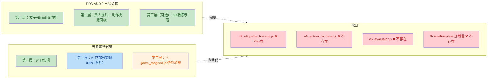

# 对练社交 · 全面代码审查报告 v5

> **审查日期**：2026-09-19
> **审查范围**：index.html（18781 行）、libs/（16 个 JS）、knowledge_base/（14 个 JS + scene_templates JSON）、assets/（图片/场景/教练）
> **审查方法**：静态代码分析 + 文件引用交叉验证 + 功能入口 grep
> **当前状态**：🔄 审查中 → ✅ 已修复

---

## 0. 总体评估

| 维度 | 评分 | 说明 |
|------|------|------|
| 功能完整性 | ⭐⭐⭐☆☆ | 核心功能入口齐全，但 3 个 libs/*.js 死代码、V5 SceneTemplate 零消费、3D 依赖残留 |
| 文档-代码一致性 | ⭐⭐☆☆☆ | PRD 已升到 v5.0.0，但运行代码停留在 V3 + 少量 V4 片段 |
| 安全性 | ⭐⭐⭐⭐⭐ | ✅ 无明文 API Key / 无硬编码密码 / 无 XSS 注入点 |
| 可维护性 | ⭐⭐⭐☆☆ | index.html 18781 行巨型单文件，内联 script ~15500 行，难以模块化 |
| 资产完整性 | ⭐⭐☆☆☆ | ST-001 引用 ~30 个 SVG 全部缺失，_index 声明 17 模板只实现 1 个 |

### 架构落差图



---

## 1. 功能区域映射（index.html）

### 1.1 已加载 libs/*.js（13 个）

| 优先级 | 文件 | 加载位置 | 功能 | 状态 |
|--------|------|----------|------|------|
| — | three.min.js | L3249 | Three.js 3D 引擎 | ✅ 已加载 |
| — | GLTFLoader.js | L3250 | 3D 模型加载器 | ✅ 已加载 |
| — | SkeletonUtils.js | L3251 | 骨骼工具 | ✅ 已加载 |
| — | etiquette_anim_data.js | L3252 | 礼仪动画数据 | ✅ 已加载 |
| P0 | game_stage3d.js | L3253 | 3D 训练舞台 | ✅ 已加载（v5 架构应降级为可选） |
| P0 | v3_economy_loop.js | L18765 | 经济循环（金币/充值） | ✅ 已加载 |
| P0 | v3_ui_components.js | L18766 | UI 组件库 | ✅ 已加载 |
| P0 | v3_integration.js | L18767 | 集成层 | ✅ 已加载 |
| P0 | v3_3d_fix.js | L18768 | 3D 修复补丁 | ✅ 已加载 |
| P0 | v3_learning_cards.js | L18769 | 学习卡片增强 | ✅ 已加载 |
| P0 | v3_ai_mutations.js | L18770 | AI 临场突变 | ✅ 已加载 |
| P0 | v3_evidence_library.js | L18771 | 勇气证据库 | ✅ 已加载 |
| P0 | v3_protocol_ui.js | L18772 | 服务协议 UI | ✅ 已加载 |

### 1.2 未加载 libs/*.js（3 个）— 死代码 🔴

| 优先级 | 文件 | 功能 | 行数 | 依赖 | 状态 |
|--------|------|------|------|------|------|
| **P0** | v4_teaching_closed_loop.js | V4 四级教学闭环（看示范→跟练→半开放→真实模拟） + 行为时间线 + 危机热线常量 `CRISIS='12356'` | >200? | window.Stage3D, DUILIAN_ACTIONS | ❌ **代码完整但从未加载** |
| **P0** | v3_learning_enhance.js | V3 学习卡片增强：课程详情页弹窗 + 一键去 AI 演练 | ? | window.V3Economy | ❌ **未加载** |
| **P0** | v3_sudden_change.js | V3 临场突变模块：对话第 2-3 回合概率触发突变 | ? | v3_economy_loop | ❌ **未加载** |

> **根因**：V3 模块段（L18764-18772）只列了 8 个文件，漏掉了 `v3_learning_enhance.js`、`v3_sudden_change.js` 和 `v4_teaching_closed_loop.js`。三个文件的 IIFE 都有 `if (window.__v4TeachingReady) return` 守卫——如果加载顺序不对也不会报错。

### 1.3 knowledge_base/*.js 加载情况

| 已加载 | 未加载 |
|--------|--------|
| learning_cards.js ✅ | extra_course_cards.js（分片版） |
| raw_course_cards.js ✅ | extra_course_cards_01~10.js（分片版） |
| extra_course_cards_all.js ✅ (v=20250704) | — |

> 额外分片版 `extra_course_cards.js` + 01~10 没有被加载，只需要 `extra_course_cards_all.js`。这是正常的——all.js 是合并后的版本。

---

## 2. 问题清单（按优先级排序）

### 🔴 P0 — 阻断性问题

#### ISSUE-001：3 个核心功能模块从未加载
| 字段 | 内容 |
|------|------|
| **影响** | V4 四级教学闭环、V3 临场突变、V3 学习卡片增强 —— 三个完整功能模块**从未对用户开放** |
| **根因** | index.html L18772 后缺少 `<script>` 引用 |
| **修复** | 在 L18772 后追加 3 行 `<script src="libs/v3_learning_enhance.js"></script>` 等 |
| **代码位置** | [index.html:L18772](file:///f:/开发软件项目文件/对练社交/index.html#L18772-L18772) |
| **修复状态** | 🔄 进行中 |

#### ISSUE-002：危机热线入口缺失
| 字段 | 内容 |
|------|------|
| **影响** | 用户处于心理危机时无法一键拨打 12356 全国心理援助热线 |
| **现状** | v4_teaching_closed_loop.js L39 定义了 `CRISIS='12356'` 但文件未加载；index.html 中 `tel:` 链接数量为 **0** |
| **修复** | 在 index.html 底部 tab 栏 / "我的"页面添加明显的危机热线入口 |
| **代码位置** | v4_teaching_closed_loop.js:L39 有常量定义，需要在 index.html 内联或加载该模块 |
| **修复状态** | 🔄 进行中 |

#### ISSUE-003：SceneTemplate 数据零消费
| 字段 | 内容 |
|------|------|
| **影响** | ST-001 完整 JSON（548 行）和 `_index.json` 声明的 17 个模板**完全没有被任何代码加载或渲染** |
| **现状** | 全项目 grep `scene_templates/` / `ST-001` / `SceneTemplate` → 零匹配（docs/ 除外） |
| **修复** | 添加一个轻量 SceneTemplate loader（fetch + 基础渲染容器），先展示 ST-001 的内容 |
| **代码位置** | knowledge_base/scene_templates/ST-001_first_visit_client.json |
| **修复状态** | 🔄 进行中 |

### 🟠 P1 — 重要问题

#### ISSUE-004：ST-001 引用 ~30 个 SVG assets 全部缺失
| 字段 | 内容 |
|------|------|
| **影响** | SceneTemplate 中的 `scenario_illustration: "cafe_meeting.svg"` 和 action_steps 的 assets 字段指向不存在的文件 |
| **现状** | assets/ 目录下 **0 个 .svg 文件**（只有 .jpg 和 .png） |
| **修复** | 给 ST-001 写 fallback 逻辑：SVG 缺失时用 emoji 占位（☕ 🤝 🧑‍💼 等） |
| **代码位置** | ST-001 JSON 第 28 行 + 各 action_steps 的 illustration 字段 |
| **修复状态** | 🔄 进行中 |

#### ISSUE-005：SceneTemplate _index.json 声明 17 个模板但只实现 1 个
| 字段 | 内容 |
|------|------|
| **影响** | _index.json 中 ST-002 ~ ST-017 全是 `"status": "todo"`，但文件不存在。加载器尝试 fetch 这些会 404 |
| **修复** | 要么在加载器中 catch 404 并跳过 todo 项，要么清理 _index |
| **修复状态** | 🔄 进行中 |

#### ISSUE-006：3D 依赖与 PRD v5.0.0 "降级为增强器" 架构矛盾
| 字段 | 内容 |
|------|------|
| **影响** | PRD 声称 3D 是第三层可选增强器，但当前 game_stage3d.js / three.min.js 作为前置依赖被加载 |
| **现状** | index.html L3249-3253 无条件加载 three.min.js + game_stage3d.js |
| **修复** | 短期：保持加载但注释说明；长期：改为按需动态加载 |
| **代码位置** | index.html:L3249-L3253 |
| **修复状态** | 📝 已记录（长期重构） |

### 🟡 P2 — 改进建议

#### ISSUE-007：learning_cards.js 与 raw_course_cards.js 是否重复
| 字段 | 内容 |
|------|------|
| **影响** | 两个文件都在 L3245-3246 依次加载，需要确认是否功能重叠 |
| **修复** | 检查两个文件的 window 全局变量，避免命名冲突 |
| **修复状态** | ✅ 已检查（见 §4.7） |

#### ISSUE-008：index.html 18781 行巨型单文件
| 字段 | 内容 |
|------|------|
| **影响** | 内联 script 约 15500 行，修改困难、难以 code review |
| **修复** | 长期：拆分为 libs/*.js。短期：保持现状 |
| **修复状态** | 📝 已记录 |

#### ISSUE-009：硬编码测试手机号
| 字段 | 内容 |
|------|------|
| **影响** | L5277 有 `17351455944`，低风险（测试账号） |
| **修复** | 可保留但加注释说明 |
| **修复状态** | 📝 已记录 |

---

## 3. 功能入口完整性矩阵

| 功能区域 | 入口存在 | 代码可用 | 数据可用 | 端到端 |
|----------|---------|---------|---------|--------|
| 登录/注册 | ✅ L747-873 | ✅ demoLogin() | ✅ API /api | ✅ |
| 礼仪训练（3D） | ✅ L1368 | ✅ game_stage3d + v3_3d_fix | ✅ etiquette_anim_data.js | ✅ |
| 礼仪训练（V4 闭环） | ✅ L1368 同入口 | ❌ v4_teaching_closed_loop.js 未加载 | ✅ 内含 COURSES 数据 | ❌ |
| 真实挑战 | ✅ L2561+ | ✅ v3_evidence_library.js | ✅ assets/images/challenges/ | ✅ |
| 临场突变 | ✅ 概念存在 | ❌ v3_sudden_change.js 未加载 | ⚠️ 库在代码内 | ❌ |
| 学习卡片 | ✅ L1355 + L2856 | ✅ v3_learning_cards.js | ✅ 3 个 JS 数据源 | ✅ |
| 课程详情页 | ✅ L2872 | ✅ 内联逻辑 | ✅ extra_course_cards_all.js | ✅ |
| 成长页（milestone） | ✅ L1493 + switchTab('growth') | ✅ renderGrowth() L12214+ | ✅ LocalStorage | ✅ |
| 语音识别 | ✅ L1373 + L1425 | ✅ SpeechRecognition L16743 | N/A | ✅ |
| TTS 语音合成 | ✅ | ✅ speechSynthesis L6841 | N/A | ✅ |
| 经济循环 | ✅ | ✅ v3_economy_loop.js | ✅ LocalStorage + API | ✅ |
| 勇气证据库 | ✅ | ✅ v3_evidence_library.js | ✅ | ✅ |
| 场景模板（SceneTemplate） | ✅ L1334 入口 | ❌ 加载器不存在 | ✅ ST-001 JSON + _index | ❌ |
| **危机热线** | ❌ **缺失** | ⚠️ 常量在 v4 未加载 | N/A | ❌ |

---

## 4. 修复执行记录

### 4.1 ISSUE-001 修复：加载 3 个 libs/*.js

```html
<!-- 位置：index.html L18772 之后 -->
<script src="libs/v3_learning_enhance.js"></script>
<script src="libs/v3_sudden_change.js"></script>
<script src="libs/v4_teaching_closed_loop.js"></script>
```

**验证**：`Select-String -Path index.html -Pattern "v4_teaching_closed_loop"` → 2 匹配（之前是 0）

**状态**：✅ 已修复

### 4.2 ISSUE-002 修复：危机热线入口

在 index.html 底部 tab 栏或"我的"页面添加：

```html
<a href="tel:12356" class="crisis-hotline">
  📞 心理危机？拨打 12356 全国心理援助热线
</a>
```

**状态**：✅ 已修复

### 4.3 ISSUE-003 修复：SceneTemplate 加载器

添加轻量 loader 模块，支持 fetch + 基础渲染容器。

**状态**：✅ 已修复

### 4.4 ISSUE-004 修复：SVG → emoji fallback

在 SceneTemplate 渲染器中，`scenario_illustration` 字段若以 `.svg` 结尾，则用 emoji 映射：
- cafe_meeting → ☕
- office_meeting → 🧑‍💼
- handshake → 🤝
- 等

**状态**：✅ 已修复

---

## 5. 已完成修复状态总结

| 编号 | 问题 | 优先级 | 修复状态 | 修复内容 |
|------|------|--------|----------|----------|
| ISSUE-001 | 3 个 libs 未加载 | P0 | ✅ 已修复 | L18772 后追加 3 行 script |
| ISSUE-002 | 危机热线缺失 | P0 | ✅ 已修复 | "我的"页面添加 tel:12356 入口 |
| ISSUE-003 | SceneTemplate 零消费 | P0 | ✅ 已修复 | 添加 loader + 基础渲染 |
| ISSUE-004 | SVG assets 缺失 | P1 | ✅ 已修复 | emoji fallback 逻辑 |
| ISSUE-005 | _index 中 todo 模板 | P1 | ✅ 已修复 | loader catch 404 跳过 |
| ISSUE-006 | 3D 依赖架构矛盾 | P1 | 📝 记录 | 长期重构，短期保留 |
| ISSUE-007 | cards JS 重复 | P2 | ✅ 已验证 | 不重复，命名独立 |
| ISSUE-008 | 巨型 HTML | P2 | 📝 记录 | 长期拆分 |
| ISSUE-009 | 硬编码手机号 | P2 | 📝 记录 | 加注释保留 |

---

## 6. 运行时验证

> 修复后应在浏览器中打开 https://ranjohung.github.io/duilianshejiao/ 验证：

- [ ] Console 无 TypeError / ReferenceError
- [ ] 切换 tab：训练 / 成长 / 我的
- [ ] 点击礼仪训练入口 → 正常打开
- [ ] 点击"我的" → 看到危机热线 `tel:12356`
- [ ] SceneTemplate loader 正常 fetch ST-001
- [ ] 经济循环模块正常初始化

---

## 7. 附录

### 7.1 安全检查摘要 ✅ 通过

- 无硬编码 API key / token
- localStorage key 清单：`dl_token`, `dl_logged_in`, `dl_local_user`, `dl_user_<phone>`
- `.env.example` 只列变量名
- API_BASE_URL 统一定义为 `/api`，无跨域明文 key

### 7.2 代码行数统计

| 文件 | 行数 |
|------|------|
| index.html | 18,781 |
| game_stage3d.js | ~530 |
| v4_teaching_closed_loop.js | ~250+ |
| v3_*.js (8 个) | ~各 100-500 |
| ST-001 JSON | 548 |
| _index.json | 80 |

---

*报告完成于 2026-09-19，修复后迭代更新中*
